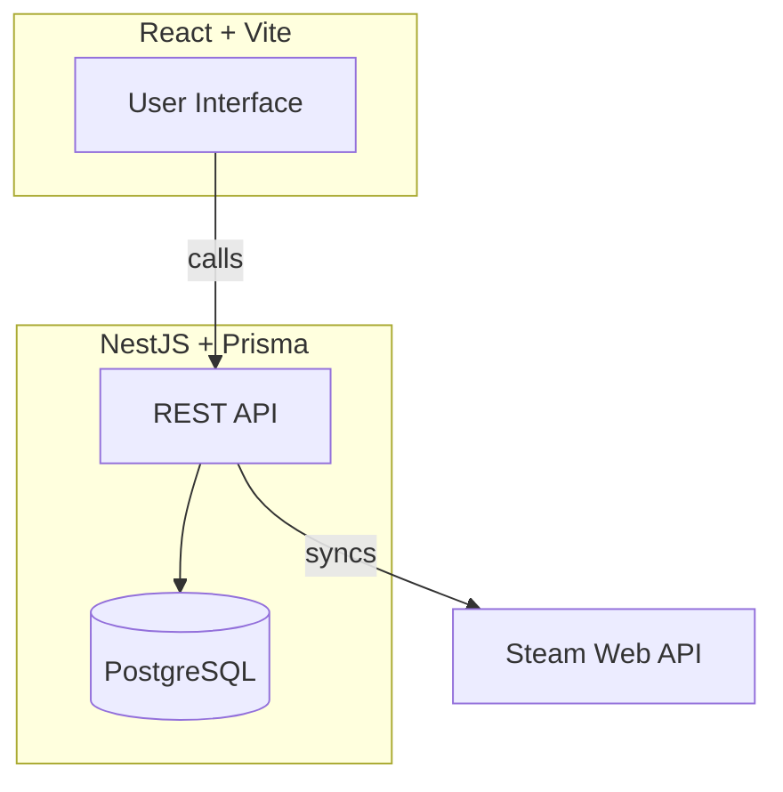

# 🎮 Game Night Matcher

## Overview

Game Night Matcher helps small groups find the best multiplayer or co-op games to play together by syncing their Steam libraries, filtering compatible games, rating/voting them, and matching based on preferences. The system includes random selection among top matches.

- **Target audience:** Friends in a group Discord
- **Tech Stack:** NestJS · Prisma · PostgreSQL · React · Vite

---

## Table of Contents

1. [Problem Statement](#problem-statement)
2. [Goals & Scope](#goals--scope)
3. [Tech Stack](#tech-stack)
4. [Feature List](#feature-list)
5. [User Stories](#user-stories)
6. [Spikes & Research Tasks](#spikes--research-tasks)
7. [System Architecture](#system-architecture)
8. [Database Design](#database-design)
9. [Agile Process](#agile-process)
10. [Contributing](#contributing)
11. [Glossary](#glossary)
12. [References](#references)
13. [Getting Started](#getting-started)
14. [API Overview](#api-overview)
15. [Next Steps](#next-steps)

---

## Problem Statement

It’s hard for groups to choose a multiplayer game everyone owns and enjoys. Steam libraries are huge, tastes differ, and group play isn’t always possible. This app automates the process of discovering, voting, and matching games for your group.

---

## Goals & Scope

### MVP Features

- Login/Authentication
- Sync Steam game libraries for each user
- Filter games by multiplayer/co-op support
- Voting system: love, like, neutral, dislike
- Match games with the highest mutual preference
- Randomize among the best matches

### Out of Scope (for now)
- Adding games manually
- Scheduling feature
- Advanced matchmaking algorithms
- Support for other game platforms (Epic, GOG, etc.)
- Containerization through Docker
- Steam authentication API for logins

---

## Tech Stack

- **Backend:** NestJS (Node.js framework)
- **Database:** PostgreSQL (with Prisma ORM)
- **Frontend:** React (with Vite for fast dev/build)

---

## Feature List

1. **User Authentication**
2. **Steam Library Sync**
3. **Game Filtering (Multiplayer/Co-op)**
4. **Voting System**
5. **Matching Algorithm**
6. **Random Game Picker**

---

## User Stories

- As a user, I want to log in so my votes are saved.
- As a user, I want to sync my Steam library so I can see my games.
- As a user, I want to see only multiplayer/co-op games.
- As a user, I want to vote on games (like/dislike/love/neutral).
- As a group, I want to see games that we all can play and enjoy.
- As a group, I want to randomize our next game from top matches.

---

## Spikes & Research Tasks

> Spikes are short investigations to resolve unknowns or risks before coding.

- **Steam API Integration:**  
  How do we fetch a user's game library and multiplayer status?
- **Game Genre/Mode Detection:**  
  How to determine if a game is multiplayer or co-op?
- **Voting Models:**  
  What’s the simplest way to store and aggregate votes?
- **Matching Logic:**  
  How do we calculate group compatibility?

---

## System Architecture

### High-Level Diagram

### Data Flow

1. API syncs Steam library (calls Steam API) from time to time.
2. Backend stores games in database.
3. User logs in.
4. Frontend displays multiplayer/co-op games.
5. Users vote on games.
6. Backend aggregates votes, matches preferences.
7. UI shows matches and allows random pick.

---

## Database Design

### Entities

- **User**
  - id (UUID), name
  - created_at, updated_at, deleted_at
  - games (UserGame relation)
  - preferences (Preference relation)
- **Game**
  - id (UUID), title, steam_id
  - created_at, updated_at, deleted_at
  - users (UserGame relation)
  - tags (GameTag relation)
- **Tag**
  - id (UUID), name
  - created_at, updated_at, deleted_at
  - games (GameTag relation)
- **Preference**
  - id (UUID), user_id, preference (enum)
  - created_at, updated_at, deleted_at
- **UserGame** (join table)
  - user_id, game_id
  - links User and Game (many-to-many)
- **GameTag** (join table)
  - game_id, tag_id
  - links Game and Tag (many-to-many)

### Relationships

- Users have many Games (via **UserGame**)
- Games have many Tags (via **GameTag**)
- Users have many Preferences
- Tags can be genres, multiplayer, co-op, etc.
- Preferences store user-specific settings or votes

**Join Tables Explained:**
- **UserGame:** Connects users and games, allowing many users to own many games.
- **GameTag:** Connects games and tags, allowing games to have multiple tags (genre, multiplayer, co-op, etc.).

---

## Agile Process

### Sprint Planning

- Plan 1-2 week sprints
- Select stories from above feature list

### Standups

- Async check-ins:  
  _"I worked on X, next up is Y, blockers Z"_

### Code Review

- Pair programming or review PRs for clarity and learning if needed

### Retrospective

- After every sprint:  
  _"What worked, what didn't, how we improve"_

---

## Contributing

1. **Document before coding:** Always start with a spike or note if you’re unsure.
2. **Branching:** Use feature branches per story.
3. **Pull Requests:** Submit PRs for all changes. Ask for review!
4. **Communication:** Log blockers and questions in Issues.

---

## Glossary

- **Spike:** Short research task to clarify unknowns
- **MVP:** Minimum Viable Product—smallest version with core features
- **Sprint:** Short, focused period of work (1–2 weeks)
- **PR:** Pull Request—proposed code change

---

## References

- [NestJS Docs](https://docs.nestjs.com/)
- [Prisma Docs](https://www.prisma.io/docs/)
- [PostgreSQL Docs](https://www.postgresql.org/docs/)
- [React Docs](https://react.dev/)
- [Vite Docs](https://vitejs.dev/)
- [Steam API Reference](https://developer.valvesoftware.com/wiki/Steam_Web_API)

---

## Getting Started

1. Read this README and glossary.
2. Set up your development environment (see [Environment](./docs/ENVIRONMENT.md)).
3. Pick a spike or user story to start with.
4. Document your findings and next steps.
5. Pair up for code reviews and feedback.

---

## API Overview

- `POST /login` — Authenticate user
- `POST /register` — Register user
- `POST /sync-library` — Sync Steam games
- `GET /games` — List games, optional filters for tags and players  
  _Example: `/games?tags=co-op,multiplayer&players=4`_
- `POST /vote` — Submit a vote
- `GET /match` — Get matched games

---

## Frontend Overview

- Login with your account
- View your synced Steam games
- Filter for multiplayer/co-op games
- Vote on games (love, like, neutral, dislike)
- See matched games for your group
- Randomize among top matches

---

## Next Steps

- Review spikes & decide which to tackle first
- Break down MVP into smaller stories/tasks
- Sketch out wireframes if desired
- Begin with research and documentation before any code!

---

## License

This project is licensed under the MIT License. See [LICENSE.md](./LICENSE.md) for details.

---

